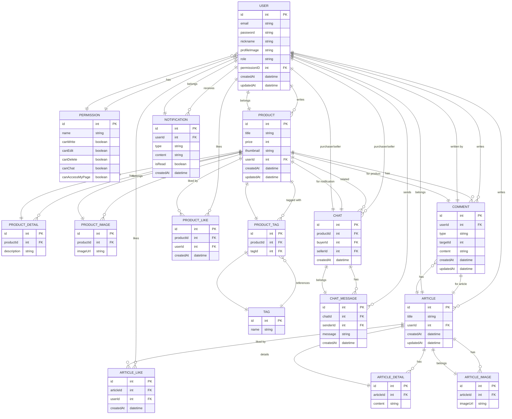

```mermaid
erDiagram

USER {
  id int PK
  email string
  password string
  nickname string
  profileImage string
  role string
  permissionID int FK
  createdAt datetime
  updatedAt datetime
}

PERMISSION {
  id int PK
  name string
  canWrite boolean
  canEdit boolean
  canDelete boolean
  canChat boolean
  canAccessMyPage boolean
}

PRODUCT {
  id int PK
  title string
  price int
  thumbnail string
  userId int FK
  createdAt datetime
  updatedAt datetime
}

PRODUCT_DETAIL {
  id int PK
  productId int FK
  description string
}

PRODUCT_IMAGE {
  id int PK
  productId int FK
  imageUrl string
}

PRODUCT_TAG {
  id int PK
  productId int FK
  tagId int FK
}

PRODUCT_LIKE {
  id int PK
  productId int FK
  userId int FK
  createdAt datetime
}

ARTICLE {
  id int PK
  title string
  userId int FK
  createdAt datetime
  updatedAt datetime
}

ARTICLE_DETAIL {
  id int PK
  articleId int FK
  content string
}

ARTICLE_IMAGE {
  id int PK
  articleId int FK
  imageUrl string
}

ARTICLE_LIKE {
  id int PK
  articleId int FK
  userId int FK
  createdAt datetime
}

COMMENT {
  id int PK
  userId int FK
  type string
  targetId int
  content string
  createdAt datetime
  updatedAt datetime
}

TAG {
  id int PK
  name string
}

CHAT {
  id int PK
  productId int FK
  buyerId int FK
  sellerId int FK
  createdAt datetime
}

CHAT_MESSAGE {
  id int PK
  chatId int FK
  senderId int FK
  message string
  createdAt datetime
}

NOTIFICATION {
  id int PK
  userId int FK
  type string
  content string
  isRead boolean
  createdAt datetime
}

USER ||--o{ PRODUCT : "writes"
USER ||--o{ ARTICLE : "writes"
USER ||--o{ COMMENT : "writes"
USER ||--o{ PRODUCT_LIKE : "likes"
USER ||--o{ ARTICLE_LIKE : "likes"
USER ||--o{ CHAT_MESSAGE : "sends"
USER ||--o{ CHAT : "purchaser/seller"
USER ||--o{ NOTIFICATION : "receives"
USER }|--|| PERMISSION : "has"

PERMISSION ||--o{ USER : ""

PRODUCT ||--|| USER : "belongs"
PRODUCT ||--o{ PRODUCT_DETAIL : "has"
PRODUCT ||--o{ PRODUCT_IMAGE : "has"
PRODUCT ||--o{ PRODUCT_TAG : "tagged with"
PRODUCT ||--o{ PRODUCT_LIKE : "liked by"
PRODUCT ||--o{ CHAT : "related"
PRODUCT ||--o{ COMMENT : "has"

PRODUCT_DETAIL ||--|| PRODUCT : "details"
PRODUCT_IMAGE ||--|| PRODUCT : "belongs"
PRODUCT_TAG }o--|| TAG : "references"

ARTICLE ||--|| USER : "belongs"
ARTICLE ||--o{ ARTICLE_DETAIL : "has"
ARTICLE ||--o{ ARTICLE_IMAGE : "has"
ARTICLE ||--o{ ARTICLE_LIKE : "liked by"
ARTICLE ||--o{ COMMENT : "has"

ARTICLE_DETAIL ||--|| ARTICLE : "details"
ARTICLE_IMAGE ||--|| ARTICLE : "belongs"

COMMENT ||--|| USER : "written by"
COMMENT ||--|| PRODUCT : "for product"
COMMENT ||--|| ARTICLE : "for article"

CHAT ||--|| PRODUCT : "for notification"
CHAT ||--|| USER : "purchaser/seller"
CHAT ||--o{ CHAT_MESSAGE : "has"

CHAT_MESSAGE ||--|| CHAT : "belongs"

NOTIFICATION ||--|| USER : "belongs"

PRODUCT_TAG ||--|| PRODUCT : ""
PRODUCT_TAG ||--|| TAG : ""


%% CommentEnum = 'PRODUCT' || 'ARTICLE'
%% UserRoleEnum = 'GUEST' || 'USER'
%% NotificationTypeEnum = 'CHAT', 'APPLICATION', ...

%% password: 최소 8자 이상
%% product.title: 최대 10자
%% product_detail.description: 최소 10자 이상
%% product.price: 숫자만 입력 가능 (int 타입)
%% tag.name: 최대 5자
```
